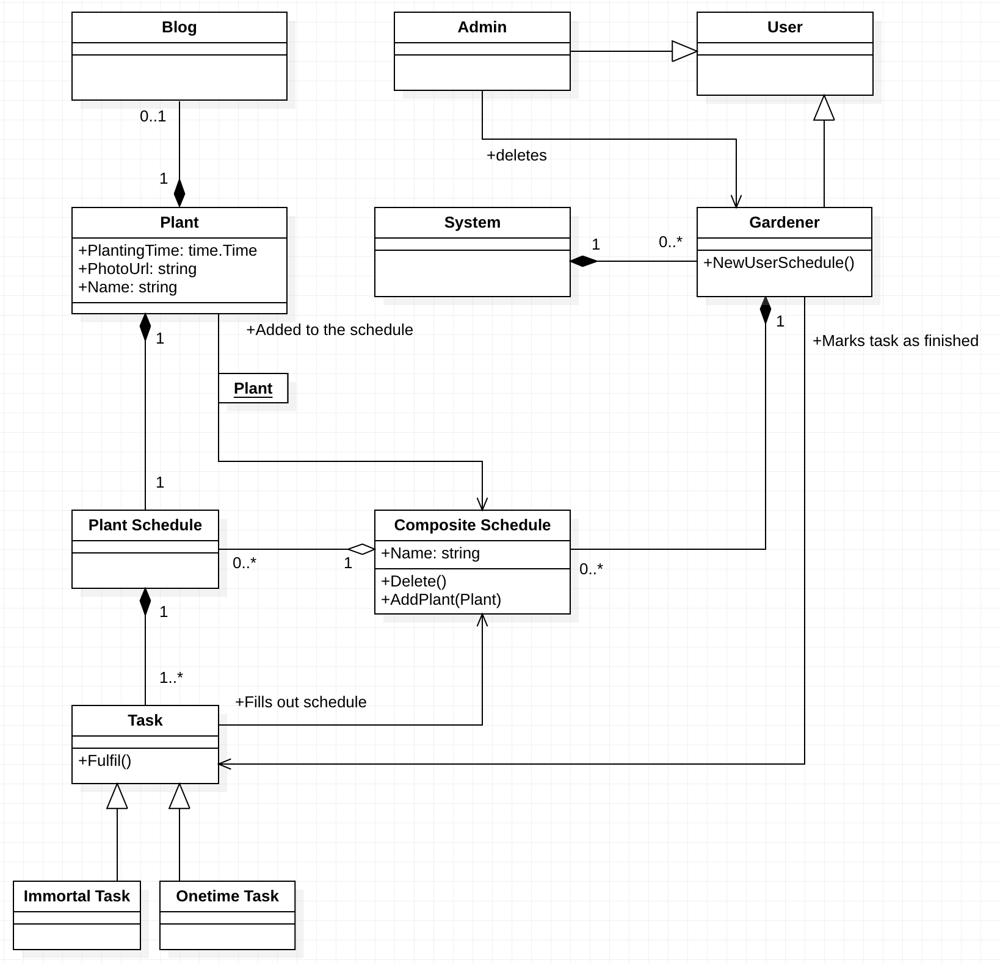
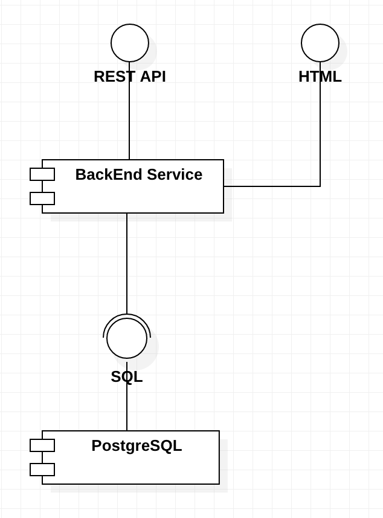

[](https://github.com/kaatinga/plantbook/blob/main/LICENSE)
[](https://codecov.io/gh/kaatinga/plantbook)
[](https://github.com/kaatinga/plantbook/actions?query=workflow%3Agolangci-lint)

# Plantbook, plants social network.


## For generate plantbook-server

nedd to be installed [go-swagger#install](https://goswagger.io/install.html)

```bash
# after change spec run command below...
swagger generate server -t internal/api -A plantbook -f ./api/swagger/swagger.yaml --main-package=../../../cmd/plantbook-server

```

## Contents

- [Plantbook, plants social network.](#plantbook-plants-social-network)
  - [For generate plantbook-server](#for-generate-plantbook-server)
  - [Contents](#contents)
  - [1. Introduction](#1-introduction)
  - [2. Components](#2-components)
  - [3. Main classes](#3-main-classes)

<a id=introduction>

## 1. Introduction

Plantbook is an online service that intended for the plant owners and gardeners who look for a tool that would allow
them to take care about their plants better. Every plant can optionally have a name and eventually a blog about
its life, that can contain photos, some sad or happy stories.

<a id=components>

## 2. Components



<a id=main-classes>

## 3. Main classes



